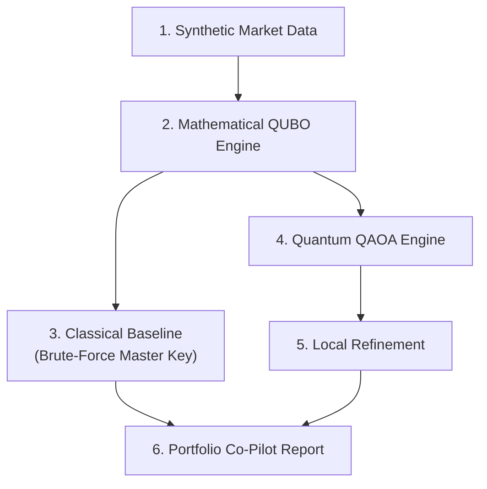

# Quantum Portfolio Optimization Engine

A hybrid optimization framework designed to solve complex portfolio allocation problems. This pipeline generates synthetic financial market data, formulates the allocation as a Quadratic Unconstrained Binary Optimization (QUBO) problem, and evaluates performance across both classical brute-force baselines and quantum Approximate Optimization Algorithm (QAOA) solvers with local optimization.

## 🏗️ System Architecture


## 🌐 Asset Universe & Decision Variables

### Asset Universe
The portfolio universe consists of **N = 10 synthetic assets** spanning multiple asset classes to enable meaningful diversification constraints later in the project.

The table below defines each asset by its unique identifier, asset name, and high-level asset class:

| ID | Asset | Class |
| :---: | :--- | :--- |
| **A1** | US Equity | Equities |
| **A2** | Intl Developed Equity | Equities |
| **A3** | Emerging Markets Equity | Equities |
| **A4** | US Govt Bonds | Fixed Income |
| **A5** | Corporate Bonds | Fixed Income |
| **A6** | Commodities Basket | Commodities |
| **A7** | FX / Currency | Currency |
| **A8** | REIT | Alternatives |
| **A9** | Infrastructure Fund | Alternatives |
| **A10** | Cash Equivalent | Cash |

> 💡 **Why Diversification Matters**
> 
> Distributing the data-universe across **5 distinct asset classes** (*Equities, Fixed Income, Commodities, Currency, and Alternatives/Cash*) ensures that sector diversification constraints have meaningful choices to make. A valid portfolio cannot simply select all equities or all bonds without violating strict asset-class-level exposure limits.

## 🛠️ Installation & Setup

### Prerequisites
Make sure you have Python 3.8 or higher installed on your system.

### Install Dependencies
To run the quantum optimization algorithms in this repository, install `qiskit` and `qiskit-algorithms` using `pip`:

```bash
pip install qiskit qiskit-algorithms
```
---

## 📌 Problem Statement

Portfolio optimization requires picking an optimal subset of assets to maximize risk-adjusted returns while adhering to operational limits. The model evaluates:

* **Expected Return vs. Risk** (Mean-Variance balance)
* **Cardinality Constraints** (Selecting exactly $B$ assets)
* **Cross-Asset Diversification** (Spanning diverse risk factors)
* **Zero Constraint Breaches** (Penalty enforcement for invalid states)

The primary goal is to find an optimal allocation binary vector that maximizes utility without violating operational boundaries.


## 🔢 Decision Variables & Portfolio Constraints

### Decision Variable Encoding

Following standard QUBO conventions, the portfolio decision variable is defined as a binary decision vector:

$$\mathbf{x} = (x_1, x_2, \dots, x_{10}) \in \{0,1\}^{10}$$

where:
* $x_i = 1$ if asset $i$ is **selected** in the portfolio
* $x_i = 0$ **otherwise**

Using discrete binary selection aligns directly with standard Ising formulations ($Z_i$ Pauli operators). It maintains a $2^{10} = 1,024$ state search space, making it small enough to run on current quantum hardware while avoiding the heavy penalty-tuning overhead associated with discretized fractional weights.

> **💡 Justification for Binary Selection (vs. Discretized Weights)**  
> Binary selection maps directly to QUBO/Ising Hamiltonians suitable for variational quantum algorithms like **QAOA** and **SamplingVQE**. It maintains a tractable search space ($2^{10} = 1,024$ possible state combinations) while eliminating penalty-weight tuning complexities inherent to discretized allocation weights.

---
### 🎯 Budget Constraint

The optimization enforces an exact cardinality constraint where the portfolio selects precisely $B = 5$ assets out of the 10 candidate universe:

$$\sum_{i=1}^{10} x_i = B \quad \text{where } B = 5$$

#### Why $B = 5$?
* **Meaningful Trade-offs:** Forces the optimizer to make hard choices between correlated and uncorrelated asset classes.
* **Realistic Concentration:** Mirrors real-world tactical asset allocation strategies where concentrated holdings (5–8 core assets) are common practice.
* **Avoids Extremes:** Prevents trivial edge cases such as $B=2$ (insufficient diversification) or $B=9$ (nearly the entire universe).

Choosing $B = 5$ forces the model to evaluate real trade-offs across correlated asset classes rather than choosing a trivial subset (like $B=1$ or $B=9$).

### ⚠️ Hardware Mapping: $N = 10$

Real-world institutional portfolio optimization operates over universes of thousands of assets, creating an exponential combinatorial bottleneck ($2^N$) that motivates quantum computing solutions. Because every binary variable maps 1:1 to a qubit, the 10-variable model requires **10 qubits**. The budget constraint is incorporated directly into the Hamiltonian matrix, meaning no additional ancilla qubits are required.

This **$N = 10$ binary model** serves as a deliberate proof-of-concept prototype to:

* **Fit Hardware Limitations:** Requires exactly 10 qubits, making it executable on NISQ hardware and local simulators without memory bottlenecks.
* **Fast Feedback Loops:** Allows rapid iteration on QUBO parameter formulation, penalty scaling, and algorithm choices.
* **Workflow Validation:** Establishes a verified end-to-end benchmark before scaling to larger qubit registers and continuous weight allocations.

---

## 📐 Mathematical Formulation

### Mean-Variance Objective

The baseline continuous mean-variance cost function balances risk ($\Sigma$) against expected return ($\boldsymbol{\mu}$):

$$f(\mathbf{x}) = q \cdot (\mathbf{x}^T \Sigma \mathbf{x}) - \boldsymbol{\mu}^T \mathbf{x}$$

where $q = 0.5$ represents the risk-aversion coefficient.

### Constrained QUBO Hamiltonian

To handle the budget constraint, a quadratic penalty term $P$ is added:

$$H(\mathbf{x}) = q (\mathbf{x}^T \Sigma \mathbf{x}) - \boldsymbol{\mu}^T \mathbf{x} + P \left( \sum_{i=1}^{10} x_i - B \right)^2$$

Where $P = 10.0$ penalizes any sampled state that deviates from $B = 5$.

```
```
## 📊 Pipeline Overview & Execution Steps

1. **Market Generation:** Constructs synthetic expected returns vector ($\boldsymbol{\mu}$) and covariance matrix ($\Sigma$).
2. **Ising Translation:** Converts QUBO matrices into Pauli $Z$ operators using standard variable change ($x_i \to \frac{1 - Z_i}{2}$).
3. **Variational Optimization:** Runs QAOA with $p=2$ layers using the COBYLA optimizer.
4. **Local Search Correction:** Executes a classical 2-swap local search on the returned state to correct minor state noise while strictly preserving $B = 5$.
```
