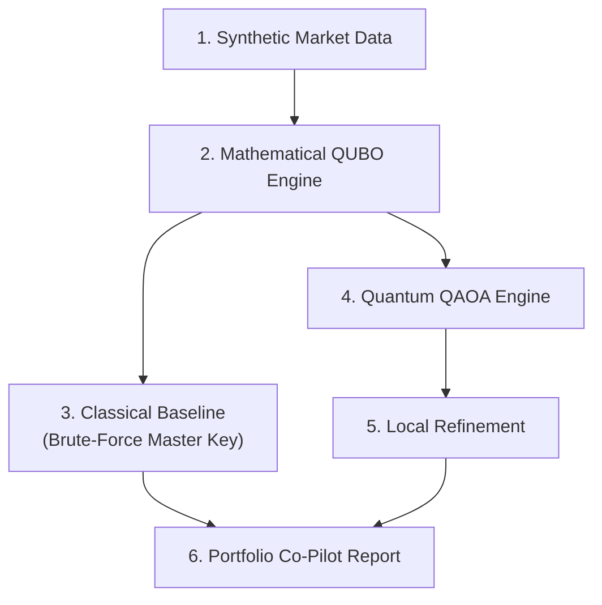

# ⚡Quantum Portfolio Optimization Engine

Optimization framework designed to solve multi-asset portfolio allocation problems. This pipeline generates synthetic financial market data, formulates the allocation as a Quadratic Unconstrained Binary Optimization (QUBO) problem, CVaR modification for the classical feedback loop and evaluates performance across both classical brute-force baselines and quantum Approximate Optimization Algorithm (QAOA) solvers with local optimization.

## 🏗️ System Architecture


## 🌐 Asset Universe & Decision Variables

The portfolio universe consists of **N = 10 synthetic assets** spanning multiple asset classes to enable meaningful diversification constraints later in the project.

The table below defines each asset by its unique identifier, asset name, and high-level asset class:

| ID | Asset | Class |
| :---: | :--- | :--- |
| **A1** | US Equity | Equities |
| **A2** | Intl Developed Equity | Equities |
| **A3** | Emerging Markets Equity | Equities |
| **A4** | US Govt Bonds | Fixed Income |
| **A5** | Corporate Bonds | Fixed Income |
| **A6** | Commodities Basket | Commodities |
| **A7** | FX / Currency | Currency |
| **A8** | REIT | Alternatives |
| **A9** | Infrastructure Fund | Alternatives |
| **A10** | Cash Equivalent | Cash |

> 💡 **Why Diversification Matters**
> 
> Distributing the data-universe across **5 distinct asset classes** (*Equities, Fixed Income, Commodities, Currency, and Alternatives/Cash*) ensures that sector diversification constraints have meaningful choices to make. A valid portfolio cannot simply select all equities or all bonds without violating strict asset-class-level exposure limits. In a nutshell it matters because of value at risk proportionality.

## 🛠️ Installation & Setup

### Prerequisites
Make sure you have Python 3.8 or higher installed on your system.

### Install Dependencies
To run the quantum optimization algorithms in this repository, install `qiskit` and `qiskit-algorithms` using `pip`:

```bash
pip install qiskit qiskit-algorithms
```
---

## 📌 Problem Statement

Portfolio optimization requires picking an optimal subset of assets to maximize risk-adjusted returns while adhering to operational limits. The model evaluates:

* **Expected Return vs. Risk** (Mean-Variance balance)
* **Cardinality Constraints** (Selecting exactly $B$ assets)
* **Cross-Asset Diversification** (Spanning diverse risk factors)
* **Zero Constraint Breaches** (Penalty enforcement for invalid states)

The primary goal is to find an optimal allocation binary vector that maximizes utility without violating operational boundaries.


## 📁 Decision Variables & Portfolio Constraints

### Decision Variable Encoding

Following standard QUBO conventions, the portfolio decision variable is defined as a binary decision vector:

$$\mathbf{x} = (x_1, x_2, \dots, x_{10}) \in \{0,1\}^{10}$$

where:
* $x_i = 1$ if asset $i$ is **selected** in the portfolio
* $x_i = 0$ **otherwise**

Using discrete binary selection aligns directly with standard Ising formulations ($Z_i$ Pauli operators). It maintains a $2^{10} = 1,024$ (bits) state space search, making it small enough to run on current quantum hardware while avoiding the heavy penalty-tuning overhead associated with discretized fractional weights.

> **💡 Justification for Binary Selection (vs. Discretized Weights)**  
> Binary selection maps directly to QUBO/Ising Hamiltonians suitable for variational quantum algorithms like **QAOA** and **SamplingVQE**. When we have parameterized quantum circuits to extract probability amplitudes by using sampling VQE. It maintains a tractable search space ($2^{10} = 1,024$ possible state combinations) while eliminating penalty-weight tuning complexities inherent to discretized allocation weights.

---
### 🎯 Budget Constraints

The optimization enforces an exact cardinality constraint where the portfolio selects precisely $B = 5$ assets out of the 10 candidate universe:

$$\sum_{i=1}^{10} x_i = B \quad \text{where } B = 5$$

#### Why $B = 5$?
* **Meaningful Trade-offs:** Forces the optimizer to make hard choices between correlated and uncorrelated asset classes.
* **Realistic Concentration:** Mirrors real-world tactical asset allocation strategies where concentrated holdings (5–8 core assets) are common practice.
* **Avoids Extremes:** Prevents trivial edge cases such as $B=2$ (insufficient diversification) or $B=9$ (nearly the entire universe).

Choosing $B = 5$ forces the model to evaluate real trade-offs across correlated asset classes rather than choosing a trivial subset (like $B=1$ or $B=9$).

### ⚙️ Hardware Mapping: $N = 10$

Real-world institutional portfolio optimization operates over universes of assets, creating an exponential combinatorial bottleneck ($2^N$) that motivates quantum computing solutions. Because every binary variable maps 1:1 to a qubit, the 10-variable model requires **10 qubits**. The budget constraint is incorporated directly into the Hamiltonian matrix, meaning no additional ancilla qubits are required.

This **$N = 10$ binary model** serves as a deliberate proof-of-concept prototype to:

* **Fit Hardware Limitations:** Requires exactly 10 qubits, making it executable on NISQ hardware and local simulators without memory bottlenecks.
* **Fast Feedback Loops:** Allows rapid iteration on QUBO parameter formulation, penalty scaling, and algorithm choices.
* **Workflow Validation:** Establishes a verified end-to-end benchmark before scaling to larger qubit registers and continuous weight allocations.

---

## 📐 Mathematical Formulation

### Mean-Variance Objective

The baseline continuous mean-variance cost function balances risk ($\Sigma$) against expected return ($\boldsymbol{\mu}$):

$$f(\mathbf{x}) = q \cdot (\mathbf{x}^T \Sigma \mathbf{x}) - \boldsymbol{\mu}^T \mathbf{x}$$

where $q = 0.5$ represents the risk-aversion coefficient.

### Constrained QUBO Hamiltonian

To handle the budget constraint, a quadratic penalty term $P$ is added:

$$H(\mathbf{x}) = q (\mathbf{x}^T \Sigma \mathbf{x}) - \boldsymbol{\mu}^T \mathbf{x} + P \left( \sum_{i=1}^{10} x_i - B \right)^2$$

Where $P = 10.0$ penalizes any sampled state that deviates from $B = 5$.

**`pauli_list`** is used as a Quantum Translator.

### 🔄 Translator Workflow

```text
┌────────────────────────────────┐
│   Classical QUBO Formulation   │  x_i ∈ {0, 1}  (Binary Variables)
└───────────────┬────────────────┘
                │
                │  Transformation: x_i = (1 - Z_i) / 2
                ▼
┌────────────────────────────────┐
│          pauli_list            │  Translator Bridge
└───────────────┬────────────────┘
                │
                ▼
┌────────────────────────────────┐
│   Quantum Ising Hamiltonian    │  Z_i ∈ {+1, -1} (Qubit Measurements)
└────────────────────────────────┘

```
## 📊 Pipeline Overview & Execution Steps

1. **Market Generation:** Constructs synthetic expected returns vector ($\boldsymbol{\mu}$) and covariance matrix ($\Sigma$).
2. **Ising Translation:** Converts QUBO matrices into Pauli $Z$ operators using standard variable change ($x_i \to \frac{1 - Z_i}{2}$).
3. **Variational Optimization:** Runs QAOA with $p=2$ layers using the COBYLA optimizer.
4. **Local Search Correction:** Executes a classical 2-swap local search on the returned state to correct state noise while strictly preserving $B = 5$.

---

## 🗄️ Dataset, Results & Code Implementation:

The repository includes results from multiple stages of the project:

Approach 1:

- https://github.com/MeghanaVS/WISER-Vanguard-Challenge/blob/main/Qiskit_Implementation-Final.ipynb
- https://github.com/MeghanaVS/WISER-Vanguard-Challenge/blob/main/manual_qaoa%20(1).pdf

Approach 2:

- [Phase 1 results](results/phase1_p1_iter20.txt)
- Phase 2 backtest report](results/phase2_report.txt)
- [Phase 2 backtest metrics](results/phase2_backtest_metrics.csv)
- [Phase 3 model-fix report](outputs/phase3_report.md)
  
---

## 📈 CVaR Integration & Literature Synthesis

### 💡 The Core Problem with Standard Expectation Values

Standard variational algorithms like VQE and QAOA calculate the energy expectation value $\langle H \rangle$ using the **arithmetic mean** across all sampled measurement outcomes:

$$\langle H \rangle = \frac{1}{M} \sum_{k=1}^{M} E(\mathbf{x}_k)$$

While arithmetic mean aggregation works well for physical system observables (e.g., ground-state energies), it introduces a structural flaw for classical combinatorial optimization problems (diagonal Hamiltonians):

* **Averaging Hides Low-Cost Solutions:** High-quality, low-energy candidate bitstrings can easily get washed out when averaged alongside high-cost, suboptimal samples.
* **Flattered Search Landscapes:** Optimization relies on finding *any* optimal ground state, not on maximizing the average quality of random quantum state measurements.
* **Cost function:** The QUBO cost function (weighted mean) translates a 10-asset portfolio optimization problem into an Ising Hamiltonian by mapping expected return ($\boldsymbol{\mu}$), risk-variance ($\mathbf{\Sigma}$), transaction costs, and liquidity preferences alongside quadratic penalty terms for budget ($B=5$). Asset-class limits into ground-state Hamiltonian.

  
### 🔋 CVaR as a Sample-Aggregation Engine

To fix this mismatch, **CVaR sample-aggregation ($\text{CVaR}_\alpha$)** modifies the classical feedback loop. Instead of averaging all $M$ measured bitstrings, the optimizer evaluates only the **best $(1 - \alpha)$ fraction** of the sampled energy distribution:

$$\text{CVaR}_\alpha = \frac{1}{\lceil \alpha M \rceil} \sum_{k=1}^{\lceil \alpha M \rceil} E(\mathbf{x}_{(k)})$$

Where:

$$E(\mathbf{x}_{(1)}) \le E(\mathbf{x}_{(2)}) \le \dots \le E(\mathbf{x}_{(M)})$$

represents the ascendingly sorted energy states sampled from the quantum circuit.

## 🔢 Output Co-pilot Report
---
    Asset selected = 5, Optimised = 4:
    
- Optimized Portfolio Bitstring: 0100110100

- Ising Hamiltonian Qubit Count: 10
- Energy Shift Offset: 24.8339
- [QAOA] Measured Bitstring: 1011101000
- [QAOA] Raw QUBO Cost: -0.1778
- [Hybrid Refinement] Best Bitstring: 1010100110
- [Hybrid Refinement] Refined Cost: -0.2194

Selected Asset Portfolio (B=5):
 - A1 (Return: 8.0%, Vol: 15.0%)
 - A3 (Return: 9.0%, Vol: 21.0%)
 - A5 (Return: 4.0%, Vol: 7.0%)
 - A8 (Return: 7.0%, Vol: 14.0%)
 - A9 (Return: 6.0%, Vol: 10.0%)
---
    Asset selected = 7:
    
[QUBO Engine Initialization]
 - Qubit Count Required: 10
 - Hamiltonian Energy Shift Offset: 28.7783
   


## 💪 Future work

* Prone to large datasets with more than 10 asset values and variables such as B>5, P to test this hypothesis
* Extend qubits simulation for scalability
  
  
## 📚 References & Credits

AI Tools used for evaluating mathematical formulae mapping verification, algorithm optimization and documentation formatting. Google Colab to execute the Co-pilot program.

references:
* WISER challenge materials (Video tutorials)
* Dataset created using the document - https://investor.vanguard.com/investor-resources-education/education/model-portfolio-allocation

## 📧 Contact Team: WISER-MPY 🤝
👩🏻‍💻 - meghanavs11@gmail.com
👩🏻‍💻 - Pa.assareh@gmail.com
👨🏾‍💻 - ymathala@gitam.in
