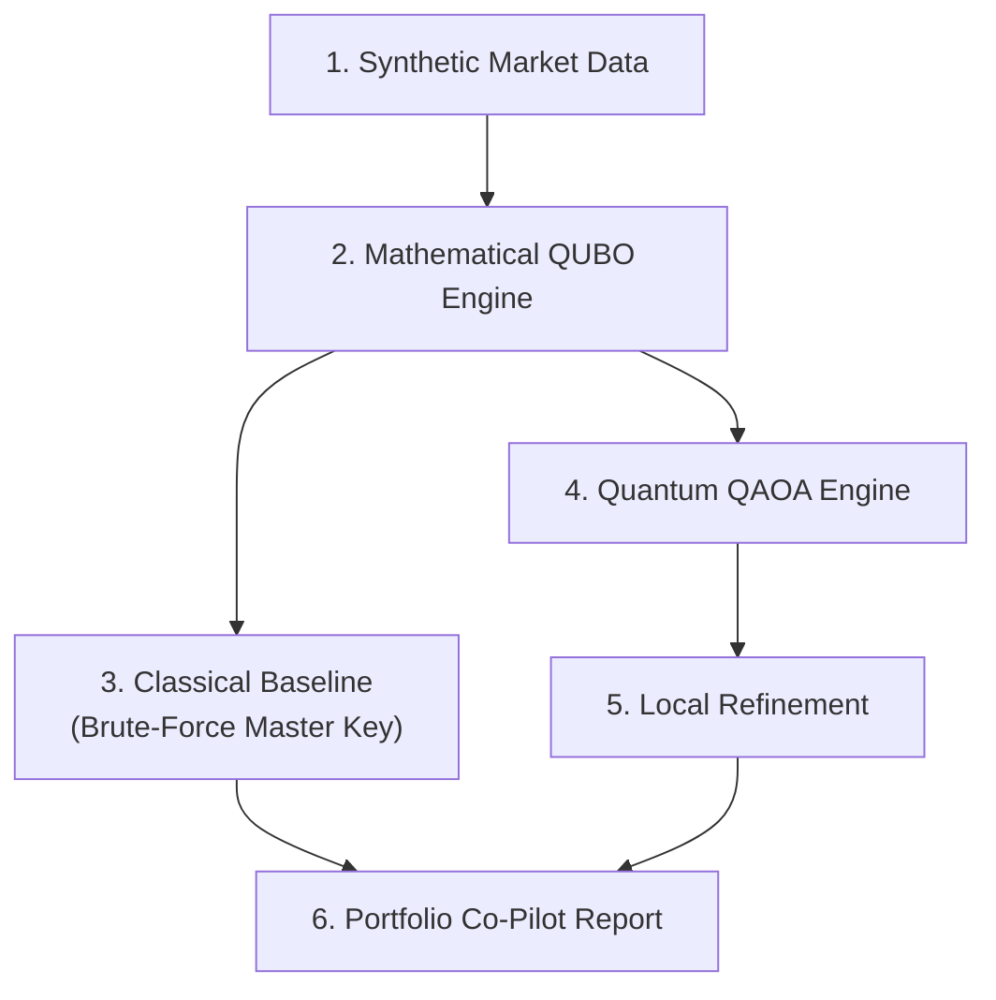

# WISER-Vanguard-Challenge

# Portfolio Optimization Engine: Quantum vs. Classical

A hybrid optimization framework designed to solve complex portfolio allocation problems. This pipeline generates synthetic financial market data, formulates the allocation as a Quadratic Unconstrained Binary Optimization (QUBO) problem, and evaluates performance across both classical brute-force baselines and quantum Approximate Optimization Algorithm (QAOA) solvers with local optimization.

## 🏗️ System Architecture

## 🌐 Asset Universe & Decision Variables

### Asset Universe
The portfolio universe consists of **N = 10 synthetic assets** spanning multiple asset classes to enable meaningful diversification constraints later in the project.

The table below defines each asset by its unique identifier, asset name, and high-level asset class:

| ID | Asset | Class |
| :---: | :--- | :--- |
| **A1** | US Equity | Equities |
| **A2** | Intl Developed Equity | Equities |
| **A3** | Emerging Markets Equity | Equities |
| **A4** | US Govt Bonds | Fixed Income |
| **A5** | Corporate Bonds | Fixed Income |
| **A6** | Commodities Basket | Commodities |
| **A7** | FX / Currency | Currency |
| **A8** | REIT | Alternatives |
| **A9** | Infrastructure Fund | Alternatives |
| **A10** | Cash Equivalent | Cash |

> 💡 **Why Diversification Matters**
> 
> Distributing the universe across **5 distinct asset classes** (*Equities, Fixed Income, Commodities, Currency, and Alternatives/Cash*) ensures that sector diversification constraints have meaningful choices to make. A valid portfolio cannot simply select all equities or all bonds without violating strict asset-class-level exposure limits.
